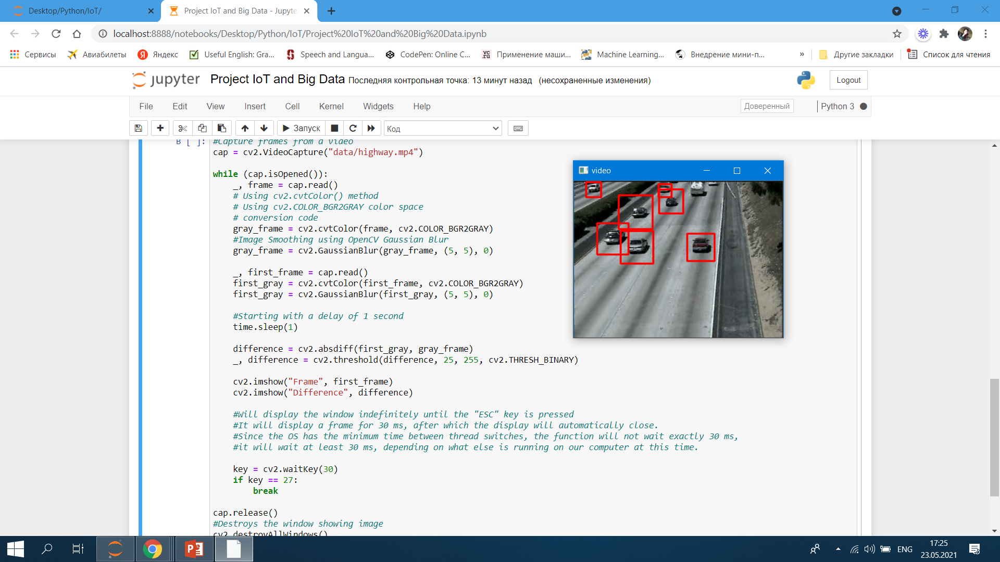
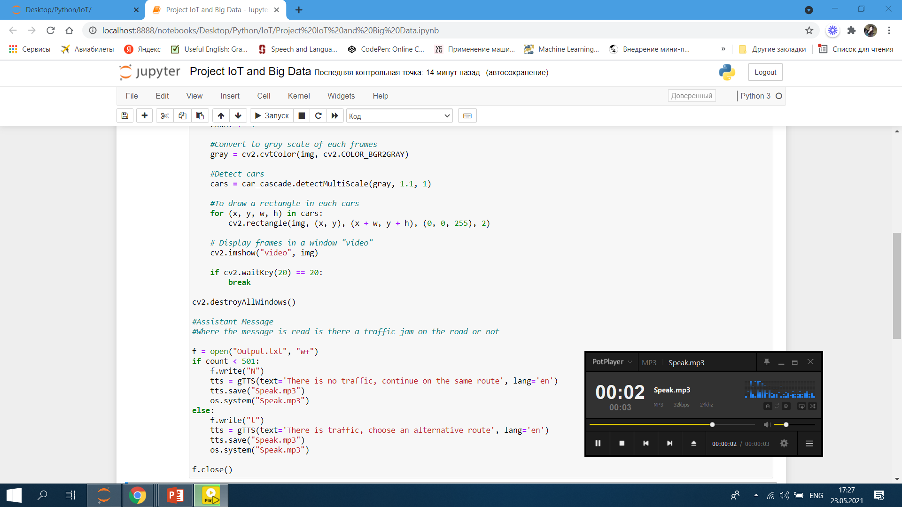
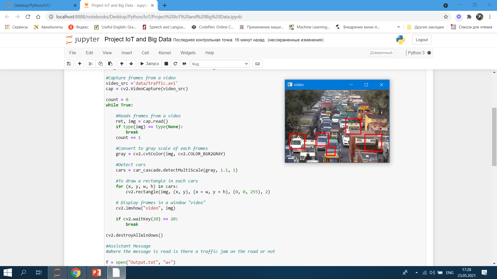
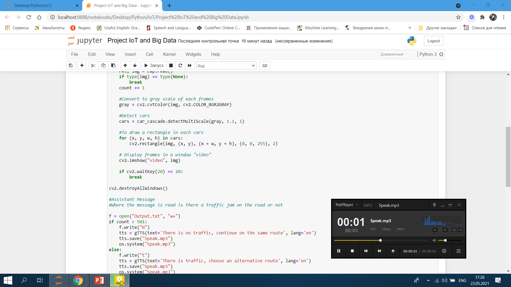

# IoT and Big Data

### The result of determining the traffic and displaying information about it

With the help of trained XML classifiers, which describe some features of the cars, we define the cars in the frame

Then, as the viewing of the record ends, we display a message about the traffic. The information message about the traffic is output in the form of an audio assistant. In this record, the following message is voiced:: "There is no traffic, continue on the same route".

In this example, we are looking at another video where there is a traffic.

The voice assistant voices this message: "There is traffic, choose an alternative route".

### 

