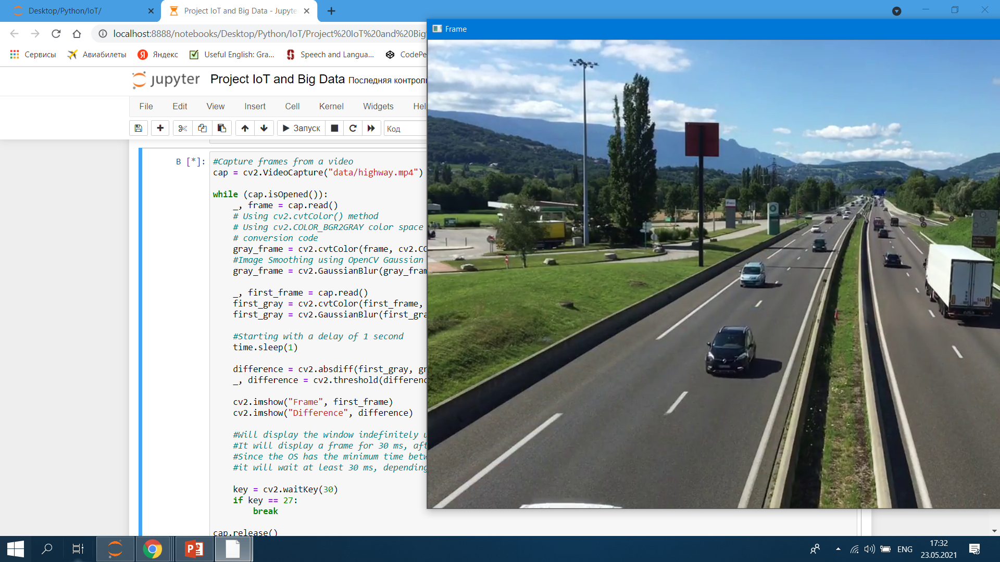
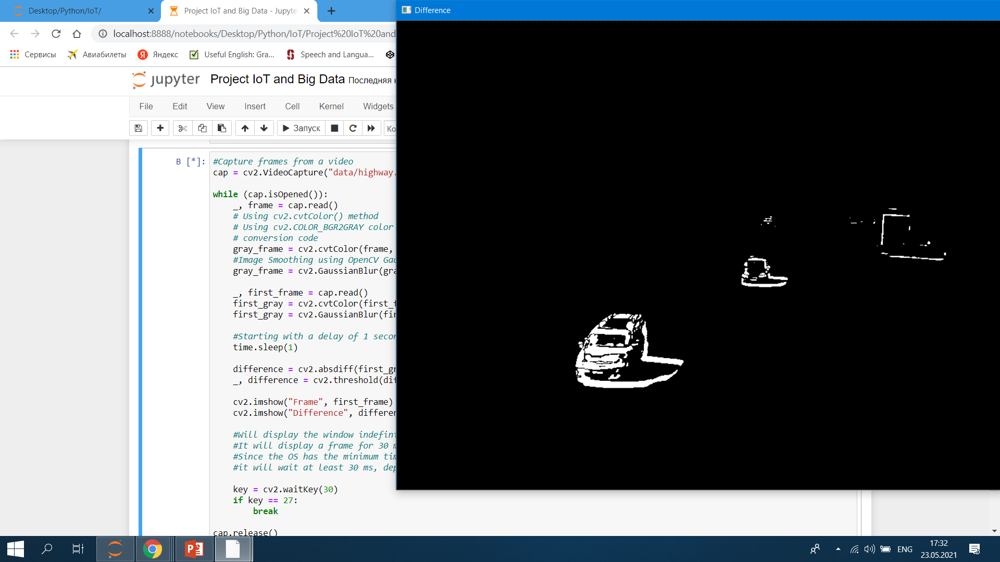
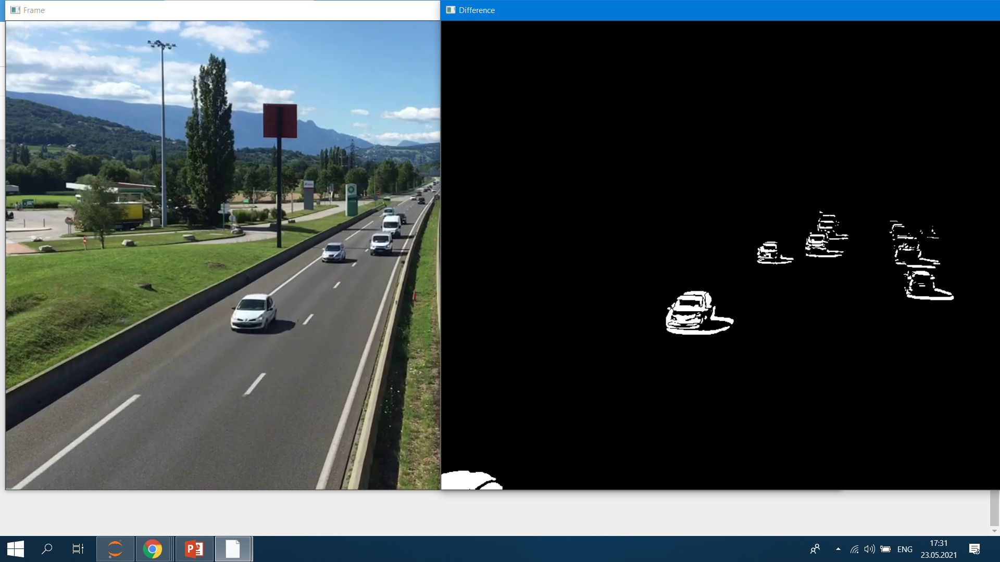

# IoT and Big Data

### The result of determining the traffic and displaying information about it

With the help of trained XML classifiers, which describe some features of the cars, we define the cars in the frame

Then, as the viewing of the record ends, we display a message about the traffic. The information message about the traffic is output in the form of an audio assistant. In this record, the following message is voiced:: "There is no traffic, continue on the same route".

In this example, we are looking at another video where there is a traffic.

The voice assistant voices this message: "There is traffic, choose an alternative route".

### Also additionally, we decided to find the absolute difference between the background and the current frame, and it looks like this:

# Conclusion

For traffic management: collecting, storing, aggregating and analyzing traffic information in real time can solve many problems, as well as optimize routes for travelers or tourists. This can be done by enabling sensors and actuators in cars, buses, and other vehicles that have the ability to process information about the flow of cars on one of the streets or avenues from centralized cameras. After which drivers or managers can decide to avoid obstacles.
